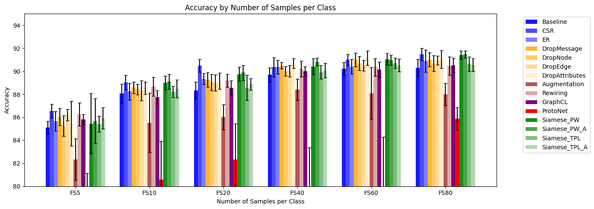
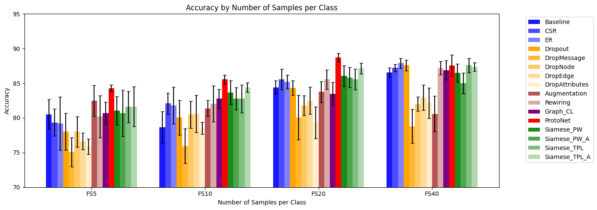

# Few-Shot Learning on Graph Neural Networks

*Few-Shot Node Classification* (FSNC) and *Few-Shot Graph Classification* (FSGC) are fundamental problems in Few-Shot Learning on Graphs, the research area that combines Graph Representation Learning and Few-Shot Learning (FSL). Despite extensive work in both domains, comprehensive studies regarding the integration of regularization and FSL strategies remain rare. In this paper, we establish baselines for more advanced methods by systematically evaluating how well models can generalize from few samples using five widely-adopted strategies: regularization, augmentation, prototypical networks, siamese networks, pre-training and fine-tuning. For each task, the same model is trained from scratch with an increasing number of samples per class. To leverage contextual information, the architecture consists of a sequence of three graph convolutional layers, which provides good inductive bias despite limited training data. Six datasets are considered for FSNC and three for FSGC, reporting as evaluation metrics micro accuracy and micro F1-score, averaged over multiple runs. Although the final performance correlates with training sample size and quality, the contribution of each strategy can be analyzed by focusing on the relative gain compared to the other methods. Results on the Mutag dataset show that Prototypical Networks excel with simple datasets having clearly separable classes, making the model more robust to outliers. Graph rewiring leads to improvements on citation graphs, suggesting our proposed heuristic benefits the task. In contrast, Cosine regularization yields the greatest performance improvements on coauthorship graphs and the Amazon Computers dataset. Overall, these preliminary findings represent a solid baseline for more advanced models which adapt prior knowledge to the presented tasks.

## Strategies

The primary approaches we investigate can be grouped into five categories:

1. **Regularization Techniques**:
    - Cosine Similarity Regularization
    - Entropy Regularization
2. **Augmentation**
    - Dropout
    - DropMessage
    - DropNode
    - DropEdge
    - DropAttributes
    - Random Edge Augmentation
    - Rewiring
3. **Pre-training and Fine-tuning**
    - Graph Contrastive Learning
4. **Prototypical Networks**
    - ProtoNet
5. **Siamese Networks**
    - Siamese Network with Pairwise Loss
    - Siamese Network with Pairwise Loss and Augmentation
    - Siamese Network with Triplet Loss
    - Siamese Network with Triplet Loss and Augmentation

## Examples
- **Few-shot Node Classification: Coauthor CS**



- **Few-shot Graph Classification: Mutag**



## Code organization

The repository follows the standard pyproject structure:

```
.
├── scripts/              # Runnable Python scripts and associated config files
│   ├── graph_classification/
│   |   ├── config_files/ # YAML configuration files for scripts
│   |   │   └── graph_classification.yaml
│   |   ├── graph_classification.py # Script for running experiment for Graph Classification
│   |   └── results
│   └── node_classification/
│       ├── config_files/ # YAML configuration files for scripts
│       │   └── node_classification.yaml
│       ├── graph_classification.py # Script for running experiment for Node Classification
│       └── results
├── src/                  # Python source code (installable package)
│   ├── data_modules/     # Data Loaders
│   ├── functions/        # Module with a function for each experiment
│   ├── losses/           # Custom loss functions 
│   ├── models/           # Models
│   └── utils.py          # Utilities mainly for training models
├── Dockerfile            # Defines the Docker image
├── entrypoint.sh         # Script run when the container starts (installs project)
├── launch_docker.sh      # Script to build and run the Docker container
├── launch_queue.sh       # Helper script for submitting jobs to a queue system
├── pyproject.toml        # Project metadata and dependencies (for pip)
└── README.md             # This file
```

Run the code inside the container
```
bash launch_docker.sh
docker attach <docker_container>
python /path/to/scripts/script.py -c /absolute/path/to/scripts/config_files/config.yaml
```
Example:
```
bash launch_docker.sh
docker attach <docker_container>
python ./script/graph_classification/graph_classification.py -c /path/to/script/graph_classification/config_files/graph_classification.yaml
```

Submit the job to a queue system:
```
bash launch_docker.sh
qsub <job_name> 1:00:00 bash launch_queue.sh /absolute/path/to/script/script.py
```
