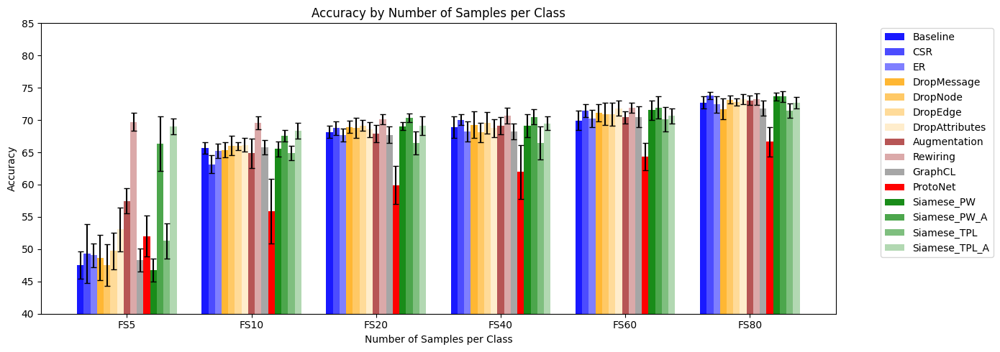

# Few-Shot Learning on Graph Neural Networks

In this project, we explore *Few-Shot Learning* (FSL) in the context of *Graph Neural Networks* (GNNs) for *Graph Classification* and *Node Classification*.

The primary approaches we investigate can be grouped into five categories:

1. **Regularization Techniques**:
    - Cosine Similarity Regularization
    - Entropy Regularization
2. **Augmentation**
    - Dropout
    - DropMessage
    - DropNode
    - DropEdge
    - DropAttributes
    - Random Edge Augmentation
    - Rewiring
3. **Pre-training and Fine-tuning**
    - Graph Contrastive Learning
4. **Prototypical Networks**
    - ProtoNet
5. **Siamese Networks**
    - Siamese Network with Pairwise Loss
    - Siamese Network with Pairwise Loss and Augmentation
    - Siamese Network with Triplet Loss
    - Siamese Network with Triplet Loss and Augmentation

## Node Classification
*Node Classification* consinsts into classify 



## Graph Classification

## Code organization

The repository follows the standard pyproject structure:

```
.
├── scripts/              # Runnable Python scripts and associated config files
│   ├── graph_classification/
│   |   ├── config_files/ # YAML configuration files for scripts
│   |   │   └── graph_classification.yaml
│   |   ├── graph_classification.py # Script for running experiment for Graph Classification
│   |   └── results
│   └── node_classification/
│       ├── config_files/ # YAML configuration files for scripts
│       │   └── node_classification.yaml
│       ├── graph_classification.py # Script for running experiment for Node Classification
│       └── results
├── src/                  # Python source code (installable package)
│   ├── data_modules/     # Data Loaders
│   ├── functions/        # Module with a function for each experiment
│   ├── losses/           # Custom loss functions 
│   ├── models/           # Models
│   └── utils.py          # Utilities mainly for training models
├── Dockerfile            # Defines the Docker image
├── entrypoint.sh         # Script run when the container starts (installs project)
├── launch_docker.sh      # Script to build and run the Docker container
├── launch_queue.sh       # Helper script for submitting jobs to a queue system
├── pyproject.toml        # Project metadata and dependencies (for pip)
└── README.md             # This file
```

Run the code inside the container
```
bash launch_docker.sh
docker attach <docker_container>
python /path/to/scripts/script.py -c /absolute/path/to/scripts/config_files/config.yaml
```
Example:
```
bash launch_docker.sh
docker attach <docker_container>
python ./script/graph_classification/graph_classification.py -c /path/to/script/graph_classification/config_files/graph_classification.yaml
```

Submit the job to a queue system:
```
bash launch_docker.sh
qsub <job_name> 1:00:00 bash launch_queue.sh /absolute/path/to/script/script.py
```

## Future improvements

- Adding hyper-parameter tuning on dropout and learing rates.
- Adding Weight and Biases tracker
- Adding Logger
